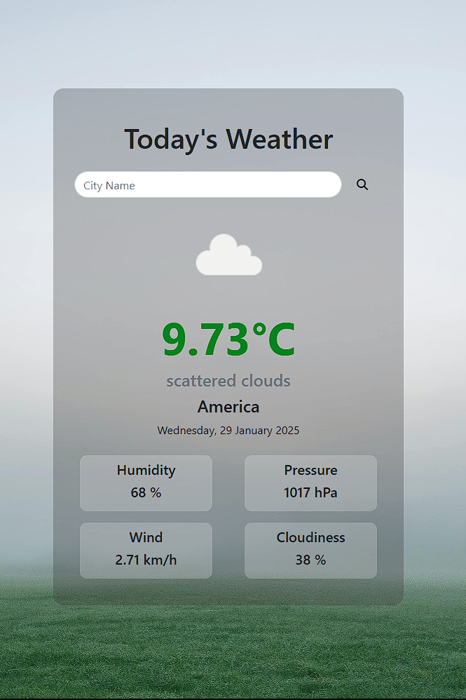
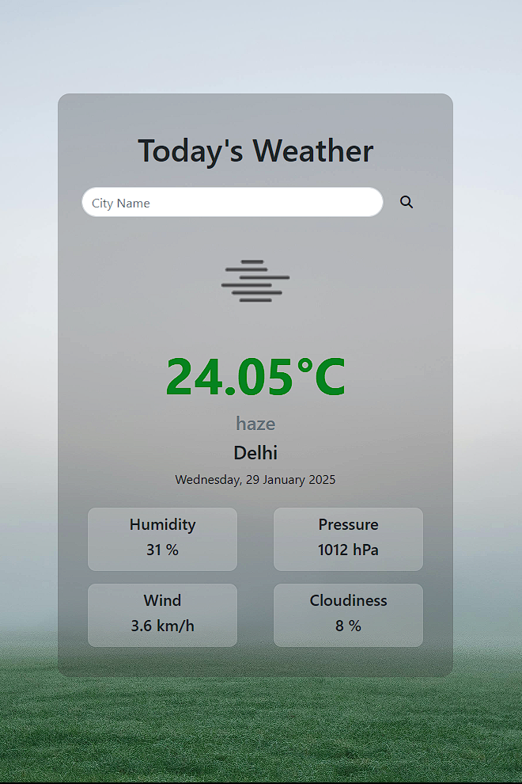
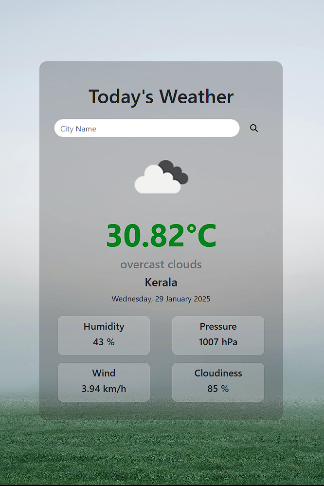
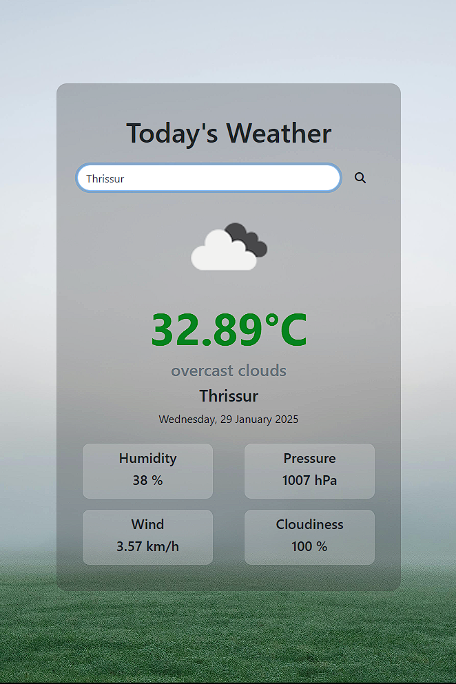

# Weather App

A simple weather application built with Django, which fetches real-time weather data from the OpenWeather API. The app displays the current weather details such as temperature, humidity, wind speed, pressure, and more for any city you search.

<p align="center">

  
  
  
  
</p>

## Features

- Displays current weather information for a specific city.
- Fetches weather data using the OpenWeather API.
- Displays city name, temperature, humidity, pressure, wind speed, cloudiness, and weather description.
- Beautiful and responsive design using Bootstrap.
- Allows users to search for weather information by city.

## Installation

### Prerequisites

Ensure you have the following installed:

- Python 3.x
- Django
- Requests library (for API requests)

### Setting Up the Project

1. Clone the repository:
   ```bash
   git clone https://github.com/your-username/weather-app.git
   cd weather-app
   
2. Create a virtual environment (optional but recommended):
   ```bash
   python -m venv venv
   source `venv\Scripts\activate`

3. Install dependencies:
   ```bash
   pip install -r requirements.txt
   
4. Run the development server:
    ```bash
    python manage.py runserver
5. Open your browser and visit http://127.0.0.1:8000/ to see the weather app in action.
